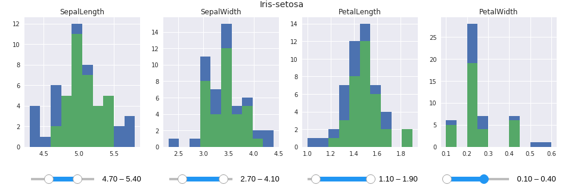

# Attribute Explorer

Based on the paper

Spence, R., & Tweedie, L. (1998). The Attribute Explorer: information synthesis via exploration. Interacting with Computers, 11(2), 137-146.

https://pdfs.semanticscholar.org/1bb0/733b3d05f258a749d668fbd1b3d3dc47c642.pdf
